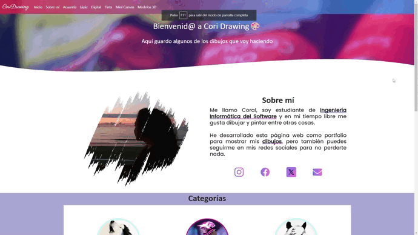

# CoriDrawing (Django)

- [CoriDrawing (Django)](#coridrawing-django)
  - [English](#english)
  - [Español](#español)

## English
CoriDrawing🎨 is a personal portfolio where I show my drawings made with different painting techniques such as acrylic, charcoal, pencil, digital and ink among other techniques, as well as 3D models created with SketchUp.

- 🌐 This project initially started as an Instagram account [@cori.drawing](https://www.instagram.com/cori.drawing/), but I decided to expand this idea by making my own website learning new technologies.

- 💻 During this process, I was able to learn and practice new technologies like **Django**, **Bootstrap** and databases like **PosgreSQL** allowing me to improve my programming and web design skills.

- 🖌 Besides learning, it allowed me to apply my skills in a personal project while enjoying my hobby of drawing and painting as a way to disconnect.

🎨 [CoriDrawing website](https://coridrawing.onrender.com/)

## Español

CoriDrawing🎨 es un porfolio personal donde muestro mis dibujos realizados con diferentes técnicas de pintura como acrílico, carboncillo, lápiz, digital y tinta china entre otras técnicas, además de modelos 3D creados con SketchUp.

- 🌐 Este proyecto comenzó inicialmente como una cuenta de Instagram [@cori.drawing](https://www.instagram.com/cori.drawing/), pero decidí ampliar esta idea realizando mi propia página web aprendiendo nuevas tecnologías.

- 💻 Durante este proceso, he podido aprender y practicar nuevas tecnologías como **Django**, **Bootstrap** y bases de datos como **PosgreSQL** permitiéndome mejorar mis habilidades de programación y diseño web.

- 🖌 Además de aprender, me permitió aplicar mis habilidades en un proyecto personal mientras disfruto de mi hobby de dibujar y pintar como forma de desconectar.

🎨 [Página web CoriDrawing](https://coridrawing.onrender.com/)